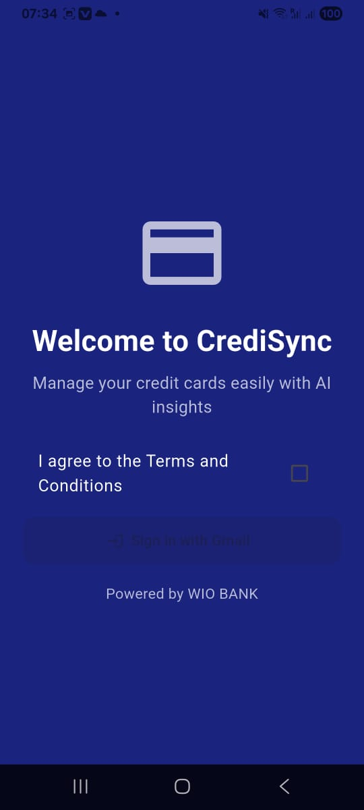

# CreditPulse 💳📈


**Transform email/SMS financial data into actionable insights**  
*A smart financial assistant that automatically analyzes credit card statements and payment reminders*

## App video demo


---

## ✨ Features

<div style="display: flex; flex-wrap: wrap; gap: 10px;">
  <div>
    <h4>🔍 Automated Tracking</h4>
    <ul>
      <li>Gmail API integration</li>
      <li>SMS payment parsing</li>
    </ul>
  </div>
  <div>
    <h4>📊 Smart Dashboard</h4>
    <ul>
      <li>Spending categorization</li>
      <li>Credit utilization charts</li>
    </ul>
  </div>
  <div>
    <h4>⏰ Proactive Alerts</h4>
    <ul>
      <li>Payment reminders</li>
      <li>Unusual spending detection</li>
    </ul>
  </div>
</div>

---
<div style="display: flex; gap: 10px; overflow-x: auto;">
   
  
</div>

## 🚀 Quick Start

### Prerequisites
- Python 3.10+
- Flutter 3.13+
- Google Cloud Platform account (for Gmail API

###API Endpoint
- [Backend](https://creditpulse.onrender.com/docs#/)
 
### Installation

Frontend (Flutter)
cd credit-pulse
flutter pub get

# For Android
flutter build apk --release

# For iOS
flutter build ios --release

# To run app
flutter run

#### Backend (Python)
```bash
cd backend
pip install -r requirements.txt
python main.py
```

 ```mermaid
graph TD
    A[User Device] -->|OAuth2| B[Gmail API]
    A -->|SMS Permissions| C[SMS Manager]
    B -->|Encrypted| D[Local Processing]
    C -->|Encrypted| D
    D -->|AES-256| E[Encrypted Storage]
    
    style A fill:#1f2020,stroke:#4a90e2
    style B fill:#1f2020,stroke:#34d058
    style C fill:#1f2020,stroke:#34d058
    style D fill:#1f2020,stroke:#d4c5f9
    style E fill:#1f2020,stroke:#f97583
```
